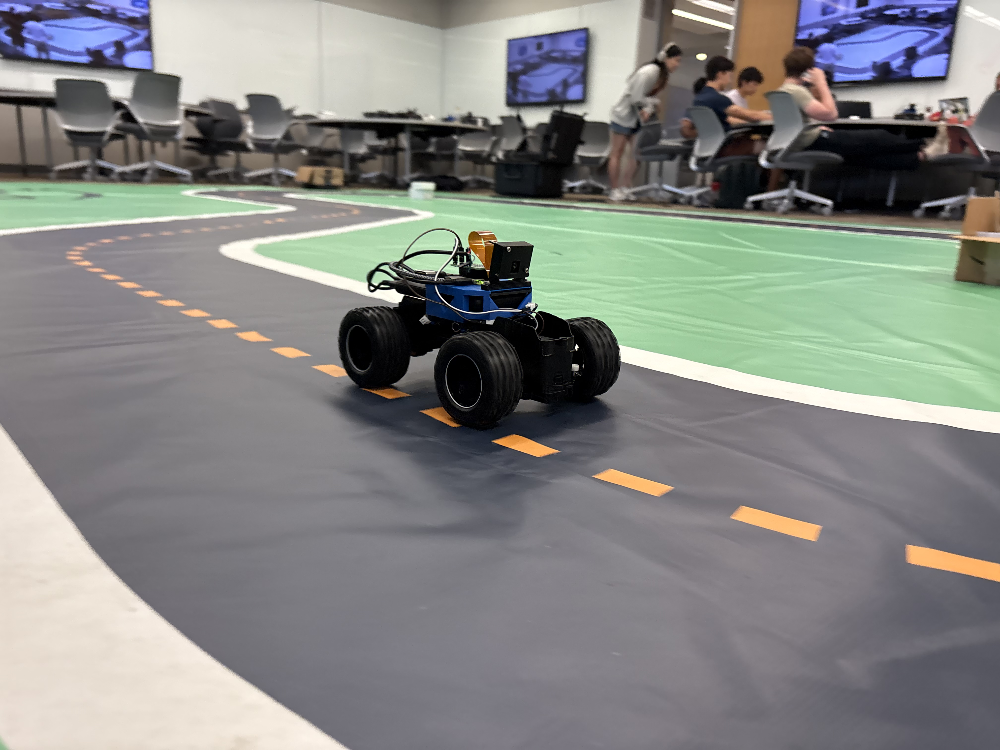

# What is DeepPiCar?

DeepPicar is a low-cost autonomous RC car platform using a deep convolutional neural network (CNN). DeepPicar is a small scale replication of NVIDIA's real self-driving car called DAVE-2, which drove on public roads using a CNN. DeepPicar uses the same CNN architecture of NVIDIA's DAVE-2 and can drive itself in real-time locally on a Raspberry Pi.
More information can be found on the project [Github page](https://github.com/CSL-KU/DeepPicar-v3) and [research paper](https://www.google.com/url?sa=t&source=web&rct=j&opi=89978449&url=http://www.ittc.ku.edu/~heechul/papers/picar-rtas2018-revised.pdf&ved=2ahUKEwie4Yb31IWPAxVABTQIHZ9bBgUQFnoECCAQAQ&usg=AOvVaw2eYzvG6Iox-VYnZzRuPc4u).

